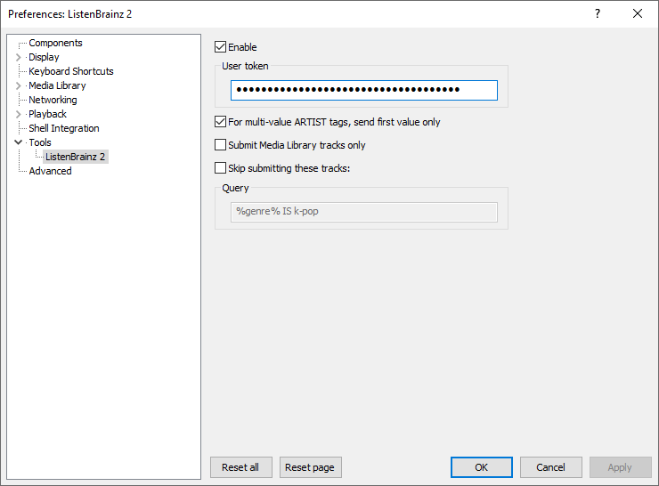

## ListenBrainz 2

### Minimum requirements

`Windows 7` and [foobar2000](https://foobar2000.org) `v1.5`.

### Download
[https://github.com/EliasAlucard/foo_listenbrainz2/releases](https://github.com/EliasAlucard/foo_listenbrainz2/releases)

### Installation

[https://wiki.hydrogenaud.io/index.php?title=Foobar2000:How_to_install_a_component](https://wiki.hydrogenaud.io/index.php?title=Foobar2000:How_to_install_a_component)

### What is ListenBrainz?

[https://listenbrainz.org](https://listenbrainz.org)

### Why foo_listenbrainz2?

Somebody else already beat me with the original name here: [https://github.com/medvid/foo_listenbrainz](https://github.com/medvid/foo_listenbrainz)

I decided to write my own because the above version blocks the main thread and freezes the UI when submitting. Also, my version submits artist/recording [MBID](https://musicbrainz.org/doc/MusicBrainz_Identifier)s if present in your files. This makes artist/title links on your recent listens page clickable and will lead you to the respective pages on [musicbrainz.org](https://musicbrainz.org)

### Preferences

Enter your [ListenBrainz token](https://listenbrainz.org/profile) and check the other options under `File>Preferences>Tools>ListenBrainz 2`.



Now just listen to your music and watch the `Console` for server responses and/or check your recent listens page. 

For convenience, submissions can be enabled/disabled via the main `Playback` menu. This option is only available after your token has been set.

### Submissions

The following conditions must be met for a track to be submitted:

- The track must be at least 5 seconds long. Anything shorter or unknown will be ignored.
- Like [Last.fm](https://last.fm), you must listen to at least half the track or 4 minutes - whichever comes first.
- The `Preferences` must be enabled when the track begins AND at the time of submission during playback.
- The track must contain `ARTIST` and `TITLE` tags as a bare minimum. Any tracks without them are silently ignored.

These additional tags are sent if present:

```
ALBUM ARTIST
ALBUM
DATE
TRACKNUMBER
TOTALTRACKS
DISCNUMBER
TOTALDISCS
ISRC
MUSICBRAINZ_ARTISTID / MUSICBRAINZ ARTIST ID
MUSICBRAINZ_TRACKID / MUSICBRAINZ TRACK ID
MUSICBRAINZ_ALBUMID / MUSICBRAINZ ALBUM ID
MUSICBRAINZ_RELEASEGROUPID / MUSICBRAINZ RELEASE GROUP ID
MUSICBRAINZ_RELEASETRACKID / MUSICBRAINZ RELEASE TRACK ID
MUSICBRAINZ_WORKID / MUSICBRAINZ WORK ID
```

Note that [foobar2000](https://foobar2000.org) does not support reading track id ([recording](https://musicbrainz.org/doc/Recording)) tags that are written to mp3s as `UFID` by [MusicBrainz Picard](https://picard.musicbrainz.org/).

### Multi-value tag handling

- For artist/work [MBID](https://musicbrainz.org/doc/MusicBrainz_Identifier)s, all values are sent. 
- By default, only the first value of any multi-value `ARTIST` tag is sent. This can be changed in the `Preferences` so all values are sent as a comma separated string. Before this option was added in `v1.1.3`, only the first value was sent.
- For all other tags, only the first value is sent.

### Caching of failed submissions

This happens automatically so you don't need to do anything to trigger it. If you're offline/[ListenBrainz](https://listenbrainz.org) is down, the `Console` will report each time a `listen` is cached and the next time you submit a successful `listen`, an attempt will be made to submit all cached entries.

### Limitations

Currently there is no support for streams or tracks of an unknown length.
